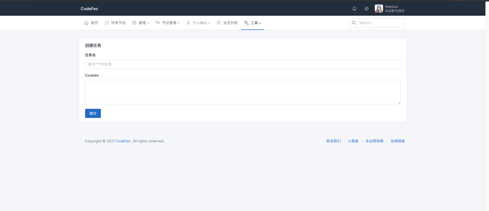

### 欢太商城自动领积分插件

#### 要求: 
PHP VERSION >=8.0
CodeFec VERSION >=V1.1.2

### 用法
1. 上传插件后并启用
2. 打开站点设置-->功能开关选择性启用`所有人可用Htshop`
3. 访问 `域名/Htshop` 创建任务
4. 添加定时任务,设置每小时在CodeFec网站根目录下执行一次 `php artisan htshop:task`

